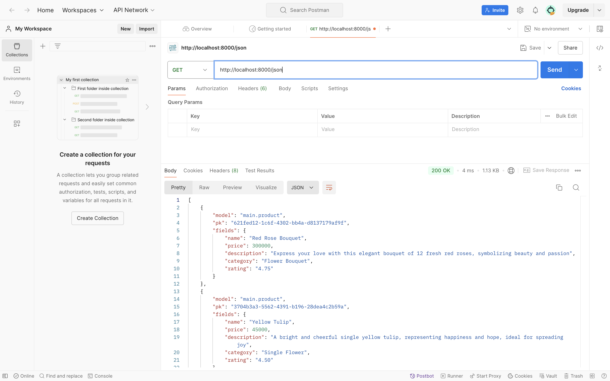
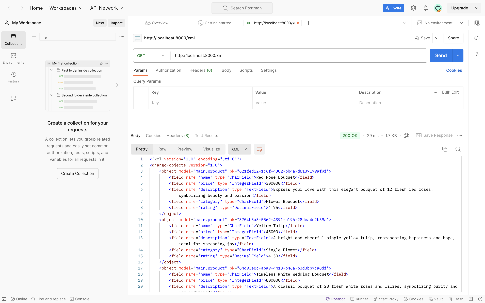
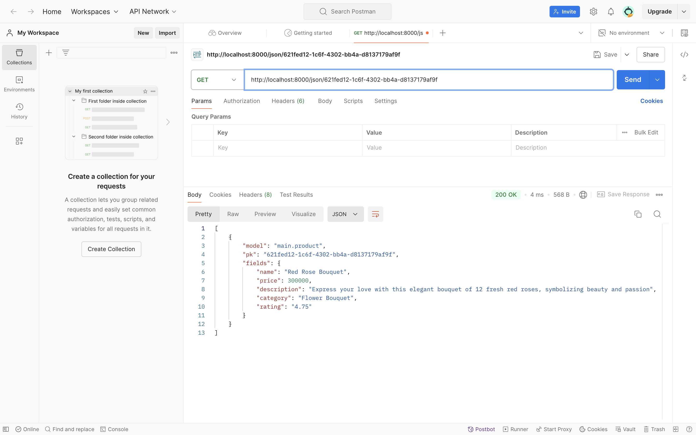
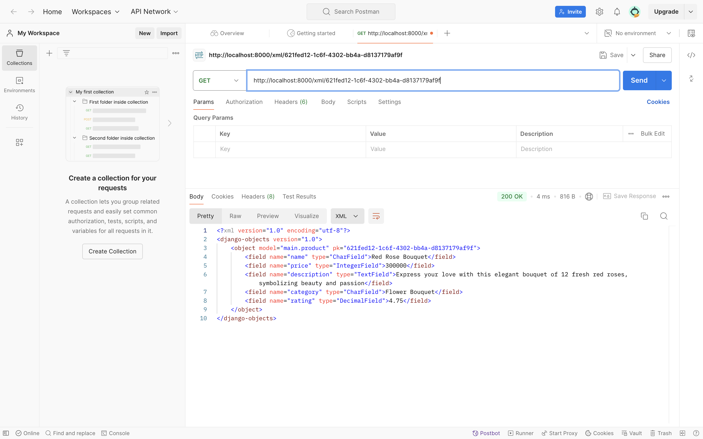

# Floryn Shop

**PWS: http://delya-ardiyanti-florynshop.pbp.cs.ui.ac.id**
**GitHub: https://github.com/04Delya/floryn-shop.git**

**Floryn Shop** adalah sebuah platform *e-commerce* yang menjual berbagai macam bunga dan tanaman hias. Proyek ini dibangun menggunakan *framework* Django untuk memberikan pengalaman belanja *online* yang optimal dan dirancang untuk memenuhi kebutuhan pelanggan secara efektif.

## TUGAS 2

- Jelaskan bagaimana cara kamu mengimplementasikan checklist di atas secara step-by-step (bukan hanya sekadar mengikuti tutorial).

    1. Membuat sebuah proyek Django baru.

    Proses pembuatan proyek ini diawali dengan membuat sebuah direktori baru dan menyiapkan *virtual environment* menggunakan perintah `python3 -m venv env`, karena saya menggunakan macOS. *Virtual environment* ini sangat penting untuk memastikan bahwa *dependencies* proyek tidak tercampur dengan *package* lain yang ada di sistem. Setelah *virtual environment* dibuat, saya mengaktifkannya dengan perintah `source env/bin/activate`.

    Langkah selanjutnya adalah membuat *file* `requirements.txt`, yang berisi daftar *dependencies* seperti `django`, `gunicorn`, `whitenoise`, `psycopg2-binary`, `requests`, dan `urllib3`. Semua *dependencies* ini kemudian dipasang menggunakan perintah `pip install -r requirements.txt`. Setelah *dependencies* terpasang, saya membuat proyek Django baru dengan nama **floryn_shop** menggunakan perintah `django-admin startproject floryn_fashion .`. Perintah ini akan menghasilkan struktur proyek Django di dalam direktori yang saya buat.

    Setelah proyek selesai dibuat, saya melakukan beberapa konfigurasi pada *file* `settings.py`. Salah satu konfigurasi pentingnya adalah menambahkan `localhost` dan `127.0.0.1` ke dalam `ALLOWED_HOSTS` untuk memastikan proyek dapat dijalankan secara lokal sebagai persiapan untuk *deployment*. Setelah konfigurasi ini selesai, saya memastikan bahwa file `manage.py` berada di direktori yang aktif di terminal. Saya kemudian menjalankan server dengan perintah `python3 manage.py runserver` dan membuka `http://localhost:8000/` di browser untuk memverifikasi bahwa proyek Django telah berjalan dengan benar.

    Untuk pengelolaan proyek, saya membuat repositori GitHub baru dengan nama **floryn-shop** dan visibilitas *public*. Saya juga menginisiasi repositori Git lokal dan menambahkan file `.gitignore` untuk mengabaikan *file* serta *folder* yang tidak diperlukan.

    2. Membuat aplikasi dengan nama `main` pada proyek tersebut.

    Saya membuat aplikasi bernama `main` dalam proyek ini dengan menjalankan perintah `python manage.py startapp main` di terminal. Perintah ini menghasilkan direktori `main` yang berisi struktur dasar aplikasi Django, seperti *folder* `migrations`, serta *file* `admin.py`, `apps.py`, dan lainnya yang mendukung fungsionalitas aplikasi.

    Setelah itu, saya mendaftarkan aplikasi `main` ke proyek Django dengan menambahkan `main` ke daftar `INSTALLED_APPS` di *file* `settings.py`. Ini memastikan Django mengenali dan mengikutsertakan aplikasi dalam konfigurasi proyek.

    Saya juga mengatur *template* untuk aplikasi dengan membuat direktori `templates` di dalam *folder* `main`. Direktori ini menyimpan *file template* yang digunakan untuk *rendering* tampilan aplikasi.

    Agar *template* dapat dikenali oleh Django, saya memeriksa pengaturan di *file* `settings.py`, memastikan konfigurasi `TEMPLATES` mencakup direktori `templates` dari aplikasi `main`, sehingga Django dapat *render* tampilan dengan benar.

    3. Membuat model pada aplikasi `main` dengan nama `Product` dan memiliki atribut wajib sebagai berikut.
    - `name`
    - `price`
    - `description`

    Pada proyek ini, saya membuat sebuah model yang bernama `Product` dengan atribut wajib yang terdiri dari `name`, `price`, dan `description`. Selain atribut wajib, saya juga menambahkan beberapa atribut tambahan seperti `category` dan `rating` untuk menambah informasi produk. Seluruh perubahan ini dilakukan dalam *file* `models.py` pada aplikasi `main`.

    Berikut adalah kode yang telah diubah dalam file `models.py`:

    ```python
    from django.db import models

    class Product(models.Model):
        name = models.CharField(max_length=255)
        price = models.IntegerField()
        description = models.TextField()
        category = models.CharField(max_length=100)
        rating = models.DecimalField(max_digits=5, decimal_places=2)
    ```
    Saya memastikan bahwa atribut `name` memiliki tipe data `CharField` dengan batasan maksimum 255 karakter. Atribut `price` diatur sebagai `IntegerField` untuk menyimpan harga produk dalam bentuk angka bulat. Untuk *product* `description`, saya menggunakan `TextField`, yang memungkinkan input teks dalam jumlah besar. Selain itu, atribut `category` ditambahkan dengan tipe data `CharField` hingga 100 karakter untuk menyimpan kategori produk, dan `rating` diatur sebagai `DecimalField` dengan maksimal 5 digit dan 2 angka desimal untuk menyimpan penilaian produk.

    Setelah mengubah berkas `models.py`, saya melakukan migrasi model dengan menjalankan perintah `python manage.py makemigrations` untuk membuat migrasi dari model yang baru dibuat. Langkah ini penting untuk memastikan bahwa Django mengenali perubahan yang terjadi dalam struktur `database`.

    Setelah migrasi dibuat, saya menerapkan perubahan tersebut ke dalam basis data lokal dengan menjalankan perintah `python manage.py migrate`. Proses ini memastikan bahwa tabel yang terkait dengan model `Product` telah dibuat dan siap digunakan di basis data.

    Setelah berhasil membuat model `Product`, saya menambahkan unit *test* pada *file* `tests.py` untuk memastikan semua proses berjalan dengan benar. Unit *test* ini dirancang untuk menguji berbagai aspek aplikasi.

    Berikut adalah isi dari *file* `tests.py`:

    ```python
    from django.test import TestCase, Client
    from .models import Product

    class mainTest(TestCase):
        def test_main_url_is_exist(self):
            response = Client().get('')
            self.assertEqual(response.status_code, 200)

        def test_main_using_main_template(self):
            response = Client().get('')
            self.assertTemplateUsed(response, 'main.html')

        def test_nonexistent_page(self):
            response = Client().get('/nonexistant/')
            self.assertEqual(response.status_code, 404)

        def test_create_product(self):
            product = Product.objects.create(
                name="Red Rose Bouquet",
                price=300000,
                description="Express your love with this elegant bouquet of 12 fresh red roses, symbolizing beauty and passion.",
                category="Flower Bouquet",
                rating=4.75
            )
            self.assertEqual(product.name, "Red Rose Bouquet")
            self.assertEqual(product.price, 300000)

        def test_product_list(self):
            Product.objects.create(name="Product 1", price=50000, description="Desc 1", category="Cat 1", rating=4.50)
            Product.objects.create(name="Product 2", price=150000, description="Desc 2", category="Cat 2", rating=4.80)
            products = Product.objects.all()
            self.assertEqual(products.count(), 2)

            self.assertEqual(products[0].name, "Product 1")
            self.assertEqual(products[0].price, 50000)

            self.assertEqual(products[1].name, "Product 2")
            self.assertEqual(products[1].price, 150000)
    ```
    Unit *test* ini melakukan beberapa pengujian penting. Pertama, `test_main_url_is_exist` memastikan bahwa URL utama aplikasi dapat diakses dan mengembalikan kode status 200. Kemudian, `test_main_using_main_template` memeriksa apakah aplikasi menggunakan *template* `main.html`. Fungsi `test_nonexistent_page` menguji respons aplikasi saat halaman yang tidak ada diakses, memastikan bahwa aplikasi mengembalikan kode status 404.

    Selain itu, `test_create_product` memverifikasi bahwa produk baru dapat dibuat dengan atribut yang benar, sementara `test_product_list` lebih menekankan pada penyesuaian harga produk yang dibuat, memastikan harga dan detail produk sesuai dengan input yang diharapkan.

    4. Membuat sebuah fungsi pada views.py untuk dikembalikan ke dalam sebuah template HTML yang menampilkan nama aplikasi serta nama dan kelas kamu.

    Fungsi `show_main` pada berkas `views.py` digunakan untuk menangani permintaan HTTP dan menampilkan informasi berupa nama aplikasi, nama, dan kelas. Pertama, modul yang diperlukan seperti *render* diimpor dari `django.shortcuts` dengan perintah `from django.shortcuts import render`. Setelah itu, fungsi `show_main` dideklarasikan dengan parameter `request`, yang berfungsi untuk memproses permintaan HTTP dari pengguna. Di dalam fungsi ini, `context` didefinisikan sebagai sebuah *dictionary* yang berisi data-data seperti `npm`, `name`, dan `class`, yang kemudian akan diteruskan ke *template*.

    Berikut adalah kode saya untuk fungsi `show_main`:

    ```python
    from django.shortcuts import render

    def show_main(request):
        context = {
        'npm': '2306245586',
        'name': 'Delya Ardiyanti',
        'class': 'PBP A'
        }

        return render(request, "main.html", context)
    ```
    Pada kode di atas, data `npm`, `name`, dan `class` disertakan dalam *dictionary* `context`. Selanjutnya, perintah `return render(request, "main.html", context)` dipanggil untuk me-*render* *template* `main.html` yang berisi data tersebut. Fungsi *render* ini menerima tiga argumen, yaitu objek `request`, nama *template* yang digunakan `(main.html)`, dan *dictionary* `context` yang berisi data yang ingin ditampilkan.

    Untuk menampilkan data pada *template* `main.html`, saya bisa menggunakan sintaks Django, yaitu `{{ npm }}, {{ name }}, dan {{ class }}`. Dengan demikian, data yang telah didefinisikan dalam `context` dapat ditampilkan secara dinamis di dalam *template*.

    5. Melakukan routing pada proyek agar dapat menjalankan aplikasi main.

    Untuk mengonfigurasi rute URL dalam proyek Django, langkah pertama adalah membuka *file* `urls.py` yang terdapat di dalam direktori proyek `floryn_shop`. Dalam konfigurasi ini, saya perlu mengimpor fungsi `include` dari modul `django.urls`, yang berfungsi untuk mengimpor rute URL dari aplikasi lain. Pada kasus ini, saya akan mengimpor rute URL dari aplikasi `main`.

    Setelah itu, pada variabel `urlpatterns`, saya menambahkan rute yang mengarahkan URL kosong `('')` ke aplikasi main. Dengan konfigurasi ini, ketika kita mengakses localhost:8000, aplikasi akan langsung mengarahkan ke halaman utama aplikasi `main`.

    Langkah terakhir yang saya lakukan adalah menjalankan proyek Django dengan perintah `python manage.py runserver` dan membuka peramban untuk melihat tampilan halaman yang sudah diatur.

    Berikut adalah isi lengkap kode untuk *file* `urls.py`:

    ```python
    from django.contrib import admin
    from django.urls import path, include

    urlpatterns = [
        path('admin/', admin.site.urls),
        path('', include('main.urls')),
    ]
    ```

    6. Membuat sebuah routing pada urls.py aplikasi main untuk memetakan fungsi yang telah dibuat pada views.py.

    File `urls.py` dalam aplikasi `main` bertugas mengatur rute URL yang terhubung dengan fungsi di `views.py`. Pertama, `path` diimpor dari modul `django.urls` untuk mendefinisikan pola URL. Fungsi `show_main` diambil dari `main.views` sebagai tampilan utama yang akan dipanggil saat URL utama `('/')` diakses. Selain itu, `app_name` digunakan untuk memberikan identitas unik pada URL aplikasi, sehingga setiap pola URL dapat dibedakan dengan jelas. *File* ini penting dalam memetakan URL ke fungsi tampilan yang sesuai. Isi *file* tersebut sebagai berikut: 

    ```python
    from django.urls import path
    from main.views import show_main

    app_name = 'main'

    urlpatterns = [
        path('', show_main, name='show_main'),
    ]
    ```

    7. Melakukan *deployment* ke PWS terhadap aplikasi yang sudah dibuat sehingga nantinya dapat diakses oleh teman-temanmu melalui Internet.

    Pertama, saya *login* ke PWS di `https://pbp.cs.ui.ac.id` menggunakan *username* dan *password*, kemudian membuat proyek baru bernama **"florynshop"** dengan menekan tombol *"Create New Project"*. Saya menyimpan *Project Credentials* yang diberikan, namun belum menjalankan *Project Command*.

    Selanjutnya, saya menambahkan URL *deployment* PWS ke `ALLOWED_HOSTS` di file `settings.py`. Format URL-nya adalah `<username-sso>-<nama proyek>.pbp.cs.ui.ac.id`. Jika *username* SSO mengandung titik (.), saya menggantinya dengan tanda *hyphen* (-), sehingga menjadi `"delya-ardiyanti-florynshop.pbp.cs.ui.ac.id"`. Setelah itu, saya menjalankan git *add*, *commit*, dan *push* ke GitHub.

    Setelah memastikan struktur repositori sudah sesuai, saya menjalankan *Project Command* dari PWS menggunakan *credentials* yang telah diberikan. Kemudian, saya mengubah nama `branch` utama menjadi `"master"` dengan menjalankan `git branch -M master` dan `git push pws master`. Setelah itu, saya memeriksa status *deployment* di *sidebar* PWS, dan jika statusnya `"Running"`, proyek sudah bisa diakses.

- Buatlah bagan yang berisi request client ke web aplikasi berbasis Django beserta responnya dan jelaskan pada bagan tersebut kaitan antara `urls.py`, `views.py`, `models.py`, dan berkas `html`.

    ```mermaid
        graph TD;
            Client -->|Request| Internet;
            Internet -->|Forward Request| DjangoProject;
            DjangoProject -->|Routing| urls.py;
            urls.py -->|Process| views.py;
            views.py -->|Access Data| models.py;
            models.py -->|Provide Data| Database;
            Database -->|Return Data| models.py;
            models.py -->|Return Data| views.py;
            views.py -->|Render| template.html;
            template.html -->|Send Response| DjangoProject;
            DjangoProject --> |Send Response| Internet;
            Internet --> |Deliver Webpage| Client;
    ```
    Saat klien mengirimkan request ke aplikasi Django melalui browser, request tersebut diteruskan oleh internet ke server. Di tahap ini, urls.py berfungsi sebagai pengatur arah, yaitu melakukan routing terhadap request yang masuk ke fungsi yang tepat di views.py. Selanjutnya, views.py akan mengakses models.py untuk mengambil data yang diperlukan dari database. Database kemudian mengembalikan data tersebut ke models.py, yang lalu dikirimkan kembali ke views.py. Setelah mendapatkan data, views.py akan menggunakan template HTML (template.html) untuk merender halaman web. Terakhir, server mengirimkan respon berupa halaman HTML yang telah dirender kembali ke browser melalui internet.

    Keterkaitan antara urls.py, views.py, models.py, dan template HTML sangat erat. Urls.py menentukan alur request ke fungsi-fungsi di views.py, yang kemudian mengelola pengambilan data dari database melalui models.py. Setelah itu, views.py memproses data tersebut menggunakan template HTML untuk merender tampilan yang akan dikirimkan sebagai respon kepada klien.


- Jelaskan fungsi git dalam pengembangan perangkat lunak!
    Git adalah perangkat yang digunakan dalam pengembangan *software* sebagai sistem kontrol versi. Alat ini berfungsi untuk menyimpan, mengelola, dan berbagi kode sumber secara efisien dan kolaboratif. Sebagai perangkat lunak *open-source*, Git dilengkapi dengan dokumentasi lengkap yang memudahkan pengguna dalam mempelajari dan menggunakannya. Tujuan utama kontrol versi ini adalah melindungi kode sumber dari kesalahan manusia (*human error*) dan penurunan kualitas akibat kejadian tidak terduga.

    Sistem kontrol versi di Git mencatat setiap modifikasi kode dalam basis data khusus. Jika terjadi kesalahan, *developer* dapat membandingkan versi sebelumnya dan memperbaikinya tanpa mengganggu pekerjaan anggota tim lain. Git juga memungkinkan *developer* memiliki salinan lengkap proyek secara lokal di komputer mereka, sehingga mereka dapat bekerja secara mandiri dan fleksibel tanpa memerlukan koneksi internet. Fitur ini melindungi kode serta riwayat revisinya dari perubahan yang tidak disengaja maupun gangguan eksternal.

    Git menyediakan fitur untuk membuat `"branch"` yang memungkinkan *developer* bekerja secara terpisah pada bagian proyek yang berbeda, dan kemudian menggabungkannya kembali menggunakan fitur `"merge"`. Sistem ini juga menyimpan riwayat perubahan secara lengkap, mencakup siapa yang membuat perubahan, kapan dilakukan, dan alasannya. Hal ini mempermudah pendeteksian bug, pemecahan masalah, dan menjaga proyek pengembangan *software* tetap terorganisir serta mudah dikelola.

- Menurut Anda, dari semua framework yang ada, mengapa framework Django dijadikan permulaan pembelajaran pengembangan perangkat lunak?
    Menurut saya, Django dipilih sebagai *framework* awal dalam pembelajaran pengembangan *software* karena fleksibilitas, skalabilitas, dan keamanan yang ditawarkannya. Sebagai *framework open-source* berbasis `Python`, Django memudahkan *developer* membuat aplikasi web yang aman, cepat, dan mudah dikelola. Dengan pendekatan MVT (*Model-View-Template*) dan prinsip DRY (*Don't Repeat Yourself*), Django membantu meminimalkan duplikasi kode dan mempercepat pengembangan. Selain itu, Django menawarkan fitur bawaan yang kuat seperti otentikasi pengguna, sistem administrasi, dan dukungan ORM, yang membuat bekerja dengan basis data lebih mudah.

- Mengapa model pada Django disebut sebagai *ORM*?
    Model pada Django disebut sebagai ORM (*Object-Relational Mapping*) karena Django memetakan objek dari model Python ke dalam tabel pada basis data relasional. Dengan menggunakan Django ORM, *developer* dapat mendefinisikan model Python yang berfungsi sebagai representasi tabel dalam basis data serta melakukan interaksi data melalui operasi objek Python tanpa menulis **query SQL** secara langsung. Fitur seperti `QuerySets` memungkinkan pengembang menyaring, mengurutkan, dan melakukan agregasi data dengan sintaks Python yang sederhana. Selain itu, Django ORM mendukung operasi CRUD (*Create, Read, Update, Delete*), yang secara otomatis menerjemahkan operasi pada objek Python menjadi perintah SQL. Hal ini membuat *developer* dapat bekerja dengan berbagai jenis basis data tanpa harus mempelajari SQL secara mendalam. Proses pemetaan ini tidak hanya meningkatkan efisiensi dan portabilitas, tetapi juga keamanan aplikasi dengan mencegah serangan seperti **SQL Injection**. Dengan demikian, Django ORM memberikan kemudahan dalam mengelola basis data serta menjaga keamanan aplikasi.

## TUGAS 3

- Jelaskan mengapa kita memerlukan data delivery dalam pengimplementasian sebuah platform?
    **Data delivery** diperlukan dalam pengimplementasian platform untuk mentransfer data antara `server` dan `klien` secara efisien. Ini memastikan bahwa informasi seperti konten, gambar, atau data lainnya dapat diterima dan ditampilkan dengan benar di sisi pengguna. Tanpa mekanisme ini, platform tidak akan berfungsi optimal karena data tidak dapat dikomunikasikan dengan baik antara komponen sistem. Contohnya, dalam platform berbasis web, data dikirim dan diterima menggunakan protokol `HTTP/HTTPS` dengan format seperti `JSON` atau `XML`.

- Menurutmu, mana yang lebih baik antara XML dan JSON? Mengapa JSON lebih populer dibandingkan XML?
    Menurut saya, `JSON` lebih unggul karena sintaksisnya yang lebih ringkas, mudah dibaca, dan ditulis. Selain itu, `JSON` juga dianggap lebih aman dibandingkan `XML`, terutama dalam konteks aplikasi web. Keunggulan lainnya adalah kompatibilitas `JSON` dengan `JavaScript` yang menjadikan `JSON` sangat efisien dalam pengembangan aplikasi web modern.

    Meskipun begitu, pemilihan antara `XML` dan `JSON` tergantung pada kebutuhan proyek. `XML` lebih cocok untuk struktur data yang kompleks dan membutuhkan metadata yang banyak, karena `XML` memiliki kemampuan yang lebih kuat dalam mendefinisikan elemen dan atribut.

    `JSON` semakin populer karena sifatnya yang lebih sederhana dan efisien, baik dalam ukuran *file* maupun kecepatan *parsing*, terutama di aplikasi web modern yang menggunakan `JavaScript`. `JSON` juga lebih mudah dibaca dan ditulis oleh manusia dibandingkan `XML`, serta secara langsung kompatibel dengan objek `JavaScript`. Sifat `JSON` yang lebih ringan dan lebih cepat menjadikannya pilihan yang lebih baik untuk aplikasi yang membutuhkan komunikasi data yang cepat dan ringan. Selain itu, `JSON` lebih mudah di-`parse` oleh browser dan bahasa pemrograman modern, memperkuat posisinya dalam pengembangan aplikasi web.

- Jelaskan fungsi dari method `is_valid()` pada form Django dan mengapa kita membutuhkan method tersebut?
    *Method* `is_valid()` pada *form* Django berfungsi untuk memvalidasi data yang dimasukkan ke dalam *form* sesuai dengan aturan yang telah didefinisikan. Jika data yang dimasukkan valid, *method* ini akan mengembalikan nilai `True`, namun jika terdapat kesalahan, *method* ini akan mengembalikan `False`. Validasi yang dilakukan mencakup berbagai aturan seperti tipe data dan panjang maksimal. Dengan menggunakan `is_valid()`, kita dapat memastikan bahwa data yang diterima sudah sesuai sebelum diproses lebih lanjut, sehingga mencegah terjadinya *error* dalam langkah berikutnya.

- Mengapa kita membutuhkan `csrf_token` saat membuat form di Django? Apa yang dapat terjadi jika kita tidak menambahkan `csrf_token` pada form Django? Bagaimana hal tersebut dapat dimanfaatkan oleh penyerang?
    **CSRF**(*Cross-Site Request Forgery*) token dalam Django digunakan untuk melindungi aplikasi dari serangan **CSRF**, di mana penyerang bisa mengirim permintaan yang tidak sah atas nama pengguna. Dengan menambahkan `csrf_token` ke dalam *form*, Django dapat memverifikasi apakah permintaan tersebut benar-benar berasal dari pengguna yang valid, bukan dari sumber yang berbahaya. Token ini dibuat secara otomatis oleh Django dan dikirim bersama permintaan ketika pengguna mengirim *form*, baik sebagai parameter POST atau melalui header (misalnya, X-CSRFToken). Setelah permintaan diterima, server akan memeriksa apakah token tersebut cocok dengan token yang ada di sesi pengguna. Jika token cocok, maka permintaan dianggap valid dan diproses. Jika tidak cocok, server akan menolak permintaan tersebut karena dianggap sebagai potensi serangan **CSRF**.

    Tanpa csrf_token, *web platform* lebih mudah terkena serangan **CSRF**. Penyerang dapat memanfaatkan sesi pengguna untuk melakukan aksi tertentu tanpa sepengetahuan pengguna. Misalnya, penyerang dapat memanipulasi *form* di situs lain untuk mengirimkan data atau melakukan transaksi berbahaya atas nama pengguna. Serangan ini bahkan dapat terjadi hanya dengan mengunjungi situs berbahaya yang memuat skrip yang melakukan tindakan di platform target. Oleh karena itu, `csrf_token` sangat penting untuk menjaga keamanan *web platform* agar tidak disalahgunakan oleh penyerang untuk mengubah atau mengambil alih data pengguna.

- Jelaskan bagaimana cara kamu mengimplementasikan checklist di atas secara step-by-step (bukan hanya sekadar mengikuti tutorial).
    1. Membuat input form untuk menambahkan objek model pada app sebelumnya.

    Untuk membuat *input form* di aplikasi Django, langkah pertama yang saya lakukan adalah membuat kerangka dasar dengan membuat direktori `templates` di *root folder*. Kemudian, saya membuat *file* `base.html` yang berfungsi sebagai *template* dasar untuk halaman-halaman lain. Template ini membantu menjaga konsistensi desain dengan menggunakan *tag* ``. Berikut adalah kode yang saya gunakan untuk `base.html`:

    ```html
    
    <!DOCTYPE html>
    <html lang="en">
    <head>
        <meta charset="UTF-8" />
        <meta name="viewport" content="width=device-width, initial-scale=1.0" />
         
    </head>

    <body>
         
    </body>
    </html>
    ```

    Setelah itu, saya menambahkan *path template* di `settings.py` agar Django mengenali direktori `templates` dengan menambahkan baris berikut:
    `'DIRS': [BASE_DIR / 'templates'],`

    Selanjutnya, di subdirektori `templates` yang ada pada direktori `main`, saya mengubah kode berkas `main.html` yang telah dibuat sebelumnya menjadi seperti berikut:

    ```html

    ...

    
    
    <h1>Floryn Shop</h1>

    <h5>NPM: </h5>
    <p>{{ npm }}<p>

    <h5>Name:</h5>
    <p>{{ name }}</p>

    <h5>Class:</h5>
    <p>{{ class }}</p>

    ...

    ```

    Langkah berikutnya, saya membuat model `Product` di `models.py`. Model ini mencakup atribut seperti `name`, `price`, `description`, `category`, dan `rating`, dengan UUID sebagai *primary key* untuk meningkatkan keamanan. Berikut adalah kode model yang saya buat:

    ```python
    import uuid 
    from django.db import models

    class Product(models.Model):
        id = models.UUIDField(primary_key=True, default=uuid.uuid4, editable=False)
        name = models.CharField(max_length=255)
        price = models.IntegerField()
        description = models.TextField()
        category = models.CharField(max_length=100)
        rating = models.DecimalField(max_digits=5, decimal_places=2)
    ```

    Kemudian, saya menjalankan perintah `makemigrations` dan `migrate` untuk memperbarui *database*:
    `python3 manage.py makemigrations`
    `python3 manage.py migrate`

    Setelah model selesai, saya membuat *form* di `forms.py` untuk menambahkan produk baru, dengan *form* ini menghubungkan model `Product` dengan *input* dari pengguna. *Form* tersebut mencakup *field* seperti `name`, `price`, `description`, `category`, dan `rating`. Berikut adalah kode untuk *form* yang saya buat:

    ```python
    from django.forms import ModelForm, TextInput, ChoiceField, DecimalField
    from main.models import Product

    class ProductForm(ModelForm):
        CATEGORY_CHOICES = [
            ('Single Flower', 'Single Flower'),
            ('Mixed Flower Arrangement', 'Mixed Flower Arrangement'),
            ('Flower Bouquet', 'Flower Bouquet'),
            ('Wedding Bouquet', 'Wedding Bouquet'),
            ('Seasonal Bouquet', 'Seasonal Bouquet'),
            ('Birthday Bouquet', 'Birthday Bouquet'),
            ('Anniversary Bouquet', 'Anniversary Bouquet'),
            ('Custom Design Bouquet', 'Custom Design Bouquet'),
        ]

        category = ChoiceField(choices=CATEGORY_CHOICES)
        
        class Meta:
            model = Product
            fields = ["name", "price", "description", "category", "rating"]

            rating = DecimalField(min_value=0.00, max_value=5.00, decimal_places=2, label='Rating')

            widgets = {
                'price': TextInput(attrs={'placeholder': 'Rp'}),
            }
    ```

    Setelah *form* dibuat, saya menambahkan fungsi `create_product` di `views.py` untuk memproses *form input*. Fungsi ini memvalidasi data yang di-*input* dan menyimpannya ke dalam *database* jika valid. Berikut adalah kode untuk fungsi tersebut:

    ```python
    from django.shortcuts import render, redirect
    from main.forms import ProductForm
    from main.models import Product

    ...

    def create_product(request):
        form = ProductForm(request.POST or None)

        if form.is_valid() and request.method == "POST":
            form.save()
            return redirect('main:show_main')

        context = {'form': form}
        return render(request, "create_product.html", context)
    
    ...

    ```

    Selain itu, saya juga memodifikasi fungsi `show_main` di `views.py` untuk menampilkan semua produk yang tersimpan di *database*. Kode yang saya gunakan adalah sebagai berikut:

    ```python

    ...
    def show_main(request):
        products = Product.objects.all()

        context = {
            'npm' : '2306245586',
            'name': 'Delya Ardiyanti',
            'class': 'PBP A',
            'products': products
        }

        return render(request, "main.html", context)
    ...

    ```

    Selanjutnya, saya menambahkan *path* URL untuk *form* di `urls.py`, agar *form* dapat diakses melalui URL tertentu. Berikut adalah kode *path*-nya:

    ```python
    from main.views import show_main, create_product

    urlpatterns = [
        path('create-product', create_product, name='create_product'),
    ]
    ```

    Setelah itu, saya membuat *template* `create_product.html` untuk menampilkan *form input* produk, menggunakan *tag* Django seperti `` dan `{{ form.as_table }}`. Berikut adalah kode untuk *file* tersebut:

    ```html
     
    
    <h1>Add New Product</h1>

    <form method="POST">
    
    <table>
        {{ form.as_table }}
        <tr>
        <td></td>
        <td>
            <input type="submit" value="Add Product" />
        </td>
        </tr>
    </table>
    </form>

    
    ```

    Terakhir, saya memodifikasi `main.html` untuk menampilkan daftar produk dalam bentuk tabel dan menyediakan *button* untuk menambah produk baru. Kode yang saya gunakan adalah:

    ```html

    ...
    
    <p>Belum ada data produk pada Floryn Shop.</p>
    
    <table>
    <tr>
        <th>Product Name</th>
        <th>Price</th>
        <th>Description</th>
        <th>Category</th>
        <th>Rating</th>
    </tr>

    
    <tr>
        <td>{{ product.name }}</td>
        <td>Rp {{ product.price }}</td>
        <td>{{ product.description }}</td>
        <td>{{ product.category }}</td>
        <td>{{ product.rating }}</td>
    </tr>
    
    </table>
    

    <br />

    <a href="">
    <button>Add New Product</button>
    </a>
    

    ```

    Setelah semua langkah selesai, saya menjalankan server Django dengan perintah `python3 manage.py runserver` dan saya kemudian mengakses `http://localhost:8000/` untuk melihat hasilnya.

    2. Tambahkan 4 fungsi `views` baru untuk melihat objek yang sudah ditambahkan dalam format XML, JSON, XML by ID, dan JSON by ID.

    Langkah pertama yang saya lakukan adalah membuka *file* `views.py` yang ada di direktori `main`. Saya menambahkan *import* untuk `HttpResponse` dan `serializers` agar nantinya bisa mengonversi data menjadi format `XML` dan `JSON`.

    ```python
    from django.http import HttpResponse
    from django.core import serializers
    ...

    ```

    Langkah berikutnya, saya membuat dua fungsi baru yaitu `show_xml` dan `show_json`. Kedua fungsi ini bertujuan untuk mengambil semua data dari model `Product` dan mengembalikannya dalam format `XML` atau `JSON`.

    ```python

    ...
    def show_xml(request):
        data = Product.objects.all()
        return HttpResponse(serializers.serialize("xml", data), content_type="application/xml")

    def show_json(request):
        data = Product.objects.all()
        return HttpResponse(serializers.serialize("json", data), content_type="application/json")

    ...

    ```

    Selanjutnya, saya membuat dua fungsi lagi yang masing-masing akan mengembalikan data berdasarkan `ID` dalam format `XML` dan `JSON`. Fungsi ini berguna ketika saya hanya ingin melihat satu data tertentu dengan `ID` spesifik.

    ```python

    ...
    def show_xml_by_id(request, id):
        data = Product.objects.filter(pk=id)
        return HttpResponse(serializers.serialize("xml", data), content_type="application/xml")

    def show_json_by_id(request, id):
        data = Product.objects.filter(pk=id)
        return HttpResponse(serializers.serialize("json", data), content_type="application/json")
    
    ```

    3. Membuat routing URL untuk masing-masing `views` yang telah ditambahkan pada poin 2.

    Setelah menyelesaikan pembuatan fungsi-fungsi untuk menampilkan data dalam format `XML` dan `JSON`, baik untuk seluruh data maupun berdasarkan `ID`, langkah berikutnya yang saya lakukan adalah mengatur *routing* URL agar setiap fungsi tersebut dapat diakses melalui `browser`. Hal ini penting untuk memastikan pengguna dapat melihat data sesuai dengan format dan kebutuhan yang diinginkan.

    Pertama, saya mengimpor semua fungsi yang sudah dibuat ke dalam *file* `urls.py`:

    ```python
    from main.views import show_main, create_product, show_xml, show_json, show_xml_by_id, show_json_by_id
    ...

    ```

    Kemudian, saya menambahkan *path* URL di dalam `urlpatterns` untuk mengakses data dalam format `XML` dan `JSON`, baik untuk seluruh data maupun berdasarkan `ID`:

    ```python

    ... 

    urlpatterns = [
        ...
        path('xml/', show_xml, name='show_xml'),
        path('json/', show_json, name='show_json'),
        path('xml/<str:id>/', show_xml_by_id, name='show_xml_by_id'),
        path('json/<str:id>/', show_json_by_id, name='show_json_by_id'),
    ]

    ```

    Langkah terakhir saya adalah menjalankan proyek Django dengan perintah `python manage.py runserver`. Setelah server berjalan, saya bisa membuka URL berikut di `browser` untuk mengakses data yang telah ditambahkan:
        - XML seluruh data: http://localhost:8000/xml/
        - JSON seluruh data: http://localhost:8000/json/
        - XML berdasarkan ID: http://localhost:8000/xml/[id]/
        - JSON berdasarkan ID: http://localhost:8000/json/[id]/

    Gantilah [id] dengan `ID` dari produk yang ingin dilihat.

- Berikut adalah hasil akses URL yang saya lakukan melalui Postman:
    1. 
    2. 
    3. 
    4. 

## TUGAS 4

- Apa perbedaan antara `HttpResponseRedirect()` dan `redirect()`
    Dalam membuat sebuah website, fungsi `HttpResponseRedirect()` dan `redirect()` sering digunakan untuk mengarahkan pengguna ke halaman lain setelah mereka melakukan tindakan tertentu. Hal tersebut dapat dilakukan dengan menggunakan fungsi `HttpResponseRedirect()` atau `redirect()`. Fungsi `HttpResponseRedirect()` hanya menerima `URL` sebagai argumen dan langsung mengirimkan pengalihan `HTTP` ke `URL` yang telah ditentukan. Sementara itu, `redirect()` lebih fleksibel karena dapat menerima `URL`, nama *view*, atau model sebagai argumen, yang kemudian dikonversi menjadi `URL`. Secara keseluruhan, `redirect()` mengembalikan hasil yang sama dengan `HttpResponseRedirect()`, tetapi lebih ringkas dan mudah dipahami.

- Jelaskan cara kerja penghubungan model `Product` dengan `User`!
    Untuk menghubungkan model `Product` dengan `User`, kita perlu menambahkan sebuah atribut bernama `user` ke dalam model `Product`. Atribut ini bertipe `ForeignKey` yang mengarah ke model `User` yang sudah ada di Django. Hal ini berguna untuk menghubungkan setiap produk dengan pengguna yang membuatnya. Saat seorang pengguna membuat produk, kita bisa mengambil data pengguna yang sedang login dari `request.user` dan menyimpannya di *field* `user` dalam model `Product`. Dengan cara ini, setiap produk yang dibuat akan selalu terhubung langsung dengan pengguna yang membuatnya. Jika suatu saat pengguna tersebut dihapus, semua produk yang dia buat pun akan terhapus secara otomatis karena kita menggunakan `on_delete=models.CASCADE`.

- Apa perbedaan antara *authentication* dan *authorization*, apakah yang dilakukan saat pengguna login? Jelaskan bagaimana Django mengimplementasikan kedua konsep tersebut.
    *Authentication* adalah proses untuk memverifikasi identitas pengguna, memastikan bahwa identitas yang mereka berikan valid dan sesuai dengan yang sudah terdaftar. Sementara itu, *authorization* adalah proses untuk menentukan hak akses pengguna setelah mereka berhasil melalui proses *authentication*. Ketika pengguna *login*, sistem akan melakukan *authentication* terlebih dahulu, biasanya dengan memeriksa *username* dan *password* yang dimasukkan. Jika cocok dengan data yang ada, sistem akan menganggap pengguna valid dan memberikan akses.

    Dalam Django, *authentication* diimplementasikan menggunakan modul bawaan yang menyediakan fungsi seperti `authenticate()` untuk memverifikasi kredensial pengguna dan `login()` untuk membuat sesi *login*. Setelah *login* berhasil, Django menggunakan *session* untuk menyimpan informasi *authentication*, sehingga pengguna dapat mengakses halaman yang dilindungi. Untuk *authorization*, Django mengelola hak akses menggunakan *decorator* seperti `@login_required` serta pengaturan izin yang dapat disesuaikan untuk tiap pengguna. Hal tersebut dilakukan untuk memastikan bahwa hanya pengguna yang memiliki *authorization* yang dapat mengakses data atau melakukan tindakan tertentu sesuai dengan izin yang diberikan dalam sistem.

- Bagaimana Django mengingat pengguna yang telah login? Jelaskan kegunaan lain dari *cookies* dan apakah semua *cookies* aman digunakan?
    Pada platform Django, *cookies*, khususnya *session cookies*, berperan penting untuk mengingat pengguna yang telah *login*. Saat pengguna melakukan *login*, Django menugaskan sebuah ***session* ID** yang unik, yang disimpan dalam *session cookie* pada browser pengguna. Setiap kali pengguna mengakses suatu halaman web, browser mengirimkan kembali *cookie* ini ke dalam server. Hal ini memungkinkan Django untuk mengidentifikasi *session* pengguna dan mempertahankan status *login*-nya.

    Berikut ini adalah fungsi lain dari *cookies*:

    1. **Mengingat Preferensi Situs**: *Cookies* mampu menyimpan preferensi seperti tema suatu website atau pilihan bahasa, memfasilitasi pengguna untuk mendapatkan pengaturan yang sama ketika mereka mengunjungi situs tersebut kembali.
    2. **Pelacakan dan Analisis**: *Cookies* digunakan untuk melacak perilaku pengguna di situs web, seperti halaman yang dikunjungi. Informasi ini berguna untuk analisis penggunaan situs dan membantu dalam peningkatan layanan.
    3. **Manajemen Iklan**: *Cookies* juga dimanfaatkan untuk menargetkan iklan berdasarkan aktivitas browsing pengguna, membuat iklan yang ditampilkan lebih relevan dengan minat pengguna.
    
    Terkait keamanan, *cookies* tidak selalu aman. *Cookies* rentan terhadap serangan seperti pencurian *cookie* atau *cross-site scripting* (XSS). Khususnya, *third-party cookies* sering mendapatkan kritik terkait masalah privasi, karena hal tersebut memungkinkan perusahaan pelacak untuk mengikuti pengguna lintas situs. Oleh karena itu, sangat penting bagi pengguna untuk mengatur keamanan dan privasi pada browser mereka serta mempertimbangkan kebijakan *cookie* dari situs yang mereka kunjungi.

- Jelaskan bagaimana cara kamu mengimplementasikan *checklist* di atas secara *step-by-step* (bukan hanya sekadar mengikuti *tutorial*).
    1. Mengimplementasikan fungsi registrasi, *login*, dan *logout* untuk memungkinkan pengguna untuk mengakses aplikasi sebelumnya dengan lancar.
        **a. Membuat Fungsi dan Form Registrasi**
        Langkah pertama yang saya lakukan untuk membuat fitur registrasi adalah mengaktifkan *virtual environment*, kemudian mengimpor `UserCreationForm` dan `messages` pada bagian atas `views.py`. Kemudian, saya menambahkan fungsi *register* untuk menampilkan *form* registrasi dan memproses data ketika pengguna mendaftar. Jika data yang dimasukkan valid, akun pengguna baru akan dibuat, dan pesan sukses akan ditampilkan menggunakan `messages.success`.

        ```python
        def register(request):
            form = UserCreationForm()

            if request.method == "POST":
                form = UserCreationForm(request.POST)
                if form.is_valid():
                    form.save()
                    messages.success(request, 'Your account has been successfully created!')
                    return redirect('main:login')
            context = {'form':form}
            return render(request, 'register.html', context)

        ```

        Selanjutnya, saya membuat *template* `register.html` untuk menampilkan *form* registrasi. Pada *template* ini, saya menggunakan `{{ form.as_table }}` untuk menampilkan *form* dalam bentuk tabel, sehingga proses pembuatan *form* menjadi lebih sederhana dan terstruktur. Terakhir, saya menambahkan jalur `URL` di `urls.py` agar halaman registrasi dapat diakses. Saya mengimpor fungsi `register` dari `views.py` dan menambahkan *path* `URL` ke dalam `urlpatterns` agar halaman registrasi dapat diakses dengan mudah.

        **b. Membuat Fungsi *Login***
        Untuk mengimplementasikan fungsi *login*, hal pertama yang saya lakukan adalah mengimpor `authenticate`, `login`, dan `AuthenticationForm` ke dalam file `views.py`. Kemudian, saya menambahkan fungsi `login_user(request)` untuk mengautentikasi pengguna yang ingin masuk ke aplikasi. Jika formulir login valid, pengguna akan diambil menggunakan `form.get_user()` dan masuk dengan fungsi `login(request, user)`, yang akan membuat sesi bagi pengguna tersebut.

        ```python
        def login_user(request):
            if request.method == 'POST':
                form = AuthenticationForm(data=request.POST)

                if form.is_valid():
                        user = form.get_user()
                        login(request, user)
                        return redirect('main:show_main')

            else:
                form = AuthenticationForm(request)
            context = {'form': form}
            return render(request, 'login.html', context)
        ```

        Selanjutnya, template `login.html` dibuat untuk menampilkan formulir *login*. Terakhir, saya menambahkan jalur `URL` di `urls.py` agar halaman *login* dapat diakses. Saya mengimpor fungsi `login_user(request)` dari `views.py` dan menambahkan *path* `URL` ke dalam `urlpatterns` agar halaman *login* dapat diakses.

        **c. Membuat Fungsi *Logout***
        Untuk membuat fungsi *logout*, langkah pertama yang saya kerjakan adalah menambahkan impor *logout* ke dalam *file* `views.py` dengan kode `from django.contrib.auth import logout`. Kemudian, saya menambahkan fungsi `logout_user(request)` yang berfungsi untuk menghapus sesi pengguna yang sedang *login* dan mengarahkan mereka kembali ke halaman *login* dengan menggunakan `logout(request)` dan `return redirect('main:login')`. 

        ```python
        def logout_user(request):
            logout(request)
            return redirect('main:login')
        ```

        Setelah itu, saya membuka *file* `main.html` dan menambahkan *button logout* menggunakan kode `href=""`, yang akan secara dinamis merujuk ke `URL` *logout* yang sudah didefinisikan. 

        ```html
        ...
        <a href="">
        <button>Logout</button>
        </a>
        ...

        ```

        Terakhir, saya menambahkan jalur `URL` di `urls.py` agar halaman *logout* dapat diakses. Saya mengimpor fungsi `logout_user(request)` dari `views.py` dan menambahkan *path* `URL` ke dalam `urlpatterns` agar halaman *logout* dapat diakses.

    2. Menampilkan detail informasi pengguna yang sedang *logged in* seperti *username* dan menerapkan *cookies* seperti *last login* pada halaman utama aplikasi.

    Setelah mengimplementasikan fungsi `registrasi`, `login`, dan `logout`, langkah selanjutnya adalah merestriksi akses ke halaman *main* agar hanya dapat diakses oleh pengguna yang sudah *login*. Untuk melakukannya, saya menambahkan impor `login_required` ke dalam *file* `views.py` dengan kode `from django.contrib.auth.decorators import login_required`.
    
    Selanjutnya, saya menambahkan *decorator* `@login_required(login_url='/login')` di atas fungsi `show_main` untuk memastikan bahwa hanya pengguna yang sudah terautentikasi dapat mengakses halaman tersebut. Jika pengguna belum login, mereka akan secara otomatis diarahkan ke halaman login. 
    
    ```python
    ...
    @login_required(login_url='/login')
    def show_main(request):
    ...

    ```
    
    Setelah menambahkan restriksi ini, saya menjalankan proyek dengan perintah `python manage.py runserver` dan membuka `http://localhost:8000/` di browser.

    Kemudian, saya menambahkan fitur untuk menggunakan *cookies* di aplikasi Django dengan menampilkan data *last login* di halaman *main*. Pertama, saya memastikan telah *logout* dari aplikasi, lalu menambahkan impor `HttpResponseRedirect`, `reverse`, dan `datetime` pada *file* `views.py`.

    Pada fungsi `login_user`, saya menambahkan fungsionalitas untuk membuat *cookie* bernama *last_login* yang berfungsi untuk mencatat kapan terakhir kali pengguna melakukan *login*. Hal ini dilakukan dengan mengganti kode pada blok `if form.is_valid()` dengan kode berikut:

    ```python
    if form.is_valid():
        user = form.get_user()
        login(request, user)
        response = HttpResponseRedirect(reverse("main:show_main"))
        response.set_cookie('last_login', str(datetime.datetime.now()))
        return response
    ```

    Kode tersebut berfungsi untuk melakukan *login*, membuat *response*, dan menambahkan *cookie last_login* ke dalam *response*. Pada fungsi `show_main`, saya menambahkan *last_login* dari *cookie* ke dalam *context* agar dapat ditampilkan di halaman *main*, kodenya sebagai berikut:

    ```python
    context = {
        ...
        'last_login': request.COOKIES['last_login'],
    }
    ```

    Selain itu, saya juga mengubah fungsi `logout_user` agar *cookie last_login* dihapus ketika pengguna *logout*. 

    ```python
    def logout_user(request):
        logout(request)
        response = HttpResponseRedirect(reverse('main:login'))
        response.delete_cookie('last_login')
        return response
    ```

    Selanjutnya, saya menambahkan kode di *file* `main.html` untuk menampilkan waktu *login* terakhir setelah *button logout*.

    ```html

    ...
    <h5>Sesi terakhir login: {{ last_login }}</h5>
    ...

    ```

    Terakhir, saya menjalankan proyek Django dengan perintah `python manage.py runserver`, lalu membuat sebuah akun dan melakukan *login*. Data *last login* akan muncul di halaman *main*. Karena saya menggunakan browser `Safari`, maka saya dapat melihat *cookie* melalui fitur *Inspect Element* di bagian `Storage > Cookies`. Jika saya melakukan *logout*, *cookie* akan dihapus dan dibuat ulang ketika saya *login* kembali.

    3. Menghubungkan model `Product` dengan `User`.
    Untuk menghubungkan setiap `Product` dengan `User` yang membuatnya, pertama-tama saya membuka *file* `models.py` dan menambahkan impor `User` dari `django.contrib.auth.models` dengan kode `from django.contrib.auth.models import User`. Pada model `Product` yang sudah ada, saya menambahkan field `User` dengan menggunakan `ForeignKey` untuk menghubungkan setiap `Product` dengan satu `User`. Hal ini berarti setiap `Product` akan terhubung dengan `User` yang membuatnya.

    ```python
    class Product(models.Model):
        user = models.ForeignKey(User, on_delete=models.CASCADE)
        ...
    ```

    Selanjutnya, saya membuka kembali *file* `views.py` dan memodifikasi fungsi `create_product`. Pada bagian ini, saya mencegah Django langsung menyimpan `Product` ke dalam *database* dengan menggunakan `commit=False`, sehingga saya dapat menambahkan `User` yang sedang *login* ke `Product` tersebut sebelum disimpan. 

    ```python

    ...
    def create_product(request):
        form = ProductForm(request.POST or None)

        if form.is_valid() and request.method == "POST":
            product = form.save(commit=False)
            product.user = request.user
            product.save()
            return redirect('main:show_main')

        context = {'form': form}
        return render(request, "create_product.html", context)
    ...

    ```
    
    Setelah itu, pada fungsi `show_main`, saya menambahkan filter agar hanya menampilkan `Products` yang terhubung dengan `User` yang sedang *login*, serta menampilkan *username* pengguna di halaman *main* menggunakan `request.user.username`.

    ```python

    ...
    def show_main(request):
    products = Product.objects.filter(user=request.user)

    context = {
        ...
        'name': request.user.username,
        ...
       
    }

    ...

    ```

    Sebelum melanjutkan, saya memastikan bahwa sudah ada minimal satu pengguna di *database*. Hal ini penting karena saat melakukan migrasi model, kita akan diminta untuk menetapkan nilai *default* untuk field `User` pada `Products` yang sudah ada di *database*. Setelah memastikan semuanya, saya menyimpan semua perubahan dan melakukan migrasi dengan perintah `python manage.py makemigrations` dan `python manage.py migrate`. Ketika diminta untuk menetapkan nilai *default*, saya memilih opsi 1.

    Setelah migrasi berhasil, saya mempersiapkan aplikasi untuk lingkungan produksi dengan menambahkan `import os` pada `settings.py`, kemudian mengubah variabel `DEBUG` agar sesuai dengan kebutuhan *production*. Selanjutnya, saya menjalankan proyek dengan perintah `python manage.py runserver`, membuat akun baru, dan *login*. `Products` yang telah dibuat oleh akun sebelumnya tidak akan muncul di akun baru, yang menandakan bahwa penghubungan `Product` dengan `User` telah berhasil dilakukan.

    4. Membuat **dua** akun pengguna dengan masing-masing **tiga* *dummy data* menggunakan model yang telah dibuat pada aplikasi sebelumnya untuk setiap akun di lokal.

    Saya telah membuat dua akun pengguna, namun karena belum ada produk, saya menambahkan tiga data *dummy* yang terhubung dengan model `Product` yang telah dibuat. Akun pertama bernama `Delya`, dengan produk sebagai berikut:

    1. *Red Rose Bouquet* dengan harga `Rp 300.000`, deskripsi `"Express your love with this elegant bouquet of 12 fresh red roses, symbolizing beauty and passion,"` kategori `Flower Bouquet`, dan rating `4.75`.
    2. *Yellow Tulip* dengan harga `Rp 45.000`, deskripsi `"A bright and cheerful single yellow tulip, representing happiness and hope, ideal for spreading joy,"` kategori `Single Flower`, dan rating `4.50`.
    3. *Timeless White Wedding Bouquet* dengan harga `Rp 800.000`, deskripsi `"A classic bouquet of 20 fresh white roses and lilies, symbolizing purity and new beginning,"` kategori `Wedding Bouquet`, dan rating `4.90`.

    Sementara itu, akun kedua bernama `Adel`, dengan produk yang dibuat sebagai berikut:

    1. *Sunflower Delight* dengan harga `Rp 80.000`, deskripsi `"An uplifting sunflower, perfect for brightening any day,"` kategori `Single Flower`, dan rating `4.80`.
    2. *Birthday Bright Blooms* dengan harga `Rp 200.000`, deskripsi `"A cheerful arrangement of sunflowers, lilies, and roses to celebrate birthdays with joy and brightness,"` kategori `Birthday Bouquet`, dan rating `4.75`.
    3. *Mixed Flower Harmony Arrangement* dengan harga `Rp 300.000`, deskripsi `"A delightful mix of roses, lilies, and daisies, blending colors and fragrances in perfect harmony,"` kategori `Mixed Flower Arrangement`, dan rating `4.85`.
    
    Dengan demikian, saya telah berhasil membuat dua akun pengguna beserta masing-masing tiga data *dummy* produk yang terhubung ke model `Product` di aplikasi `Floryn Shop`.

## TUGAS 5

- Jika terdapat beberapa CSS selector untuk suatu elemen HTML, jelaskan urutan prioritas pengambilan CSS selector tersebut!

    Urutan prioritas selektor CSS adalah aspek penting dalam pengembangan web karena membantu menyelesaikan konflik antara berbagai aturan CSS yang memfokuskan elemen yang sama, sehingga memastikan tampilan visual pada sebuah situs tetap konsisten dan akurat. Berikut ini adalah urutan prioritas selektor dari yang tertinggi hingga yang terendah:

    1. `!important`: Digunakan untuk menimpa semua aturan lain, memberikan prioritas tertinggi pada properti tertentu dalam *stylesheet*. Meskipun efektif, penggunaannya disarankan untuk dihindari karena dapat mempersulit pengelolaan CSS.
    2. `Inline Styles`: *Style* yang diterapkan langsung melalui atribut *style* pada elemen yang memiliki prioritas lebih tinggi dibandingkan `ID selector`, karena diterapkan secara langsung pada elemen tersebut.
    3. `ID Selector` (#idName):  Selector ini memiliki prioritas lebih tinggi dibandingkan `pseudo-classes`, karena menargetkan elemen berdasarkan ID unik yang sangat spesifik.
    4. `Pseudo-classes` (seperti :hover, :first-child): Selector ini menargetkan elemen berdasarkan kondisi tertentu, dengan prioritas yang lebih tinggi dari `class` dan `attribute selector`.
    5. `Attribute Selector` (seperti [type="text"]): Selector ini menargetkan elemen berdasarkan atribut tertentu, dengan prioritas setara dengan `class selector`.
    6. `Class Selector` (.className): Selector ini menargetkan elemen berdasarkan kelas yang diberikan, memiliki prioritas yang lebih tinggi dari `type selector`.
    7. `Type Selector` (seperti h1, div, p): Selector ini menargetkan elemen berdasarkan jenisnya, dengan prioritas lebih tinggi dari `universal selector`.
    8. `Universal Selector` (*): Selector ini berada pada prioritas terendah dan berlaku untuk semua elemen dalam dokumen HTML.

    Dengan urutan ini, jika beberapa *selector* memiliki *specificity* yang sama, aturan yang terletak paling akhir dalam *file* CSS akan digunakan.

- Mengapa *responsive design* menjadi konsep yang penting dalam pengembangan aplikasi web? Berikan contoh aplikasi yang sudah dan belum menerapkan *responsive design*!
    *Responsive Design* merupakan aspek yang penting dalam pengembangan web karena memungkinkan suatu *website* untuk menyesuaikan dengan ukuran layar yang beragam dari berbagai perangkat, seperti *desktop*, tablet, dan ponsel. Pentingnya *design* ini dapat dilihat dari banyaknya pengguna saat ini yang mengakses internet menggunakan perangkat dengan resolusi yang berbeda-beda. Tanpa *responsive design*, *website* dapat terlihat kurang sesuai dan sulit untuk dioperasikan pada perangkat tertentu.

    Sebagai contoh, **GitHub** telah berhasil menerapkan *responsive design*. Dalam tampilan *desktop*, web ini menampilkan *layout* dengan menu yang lengkap serta memudahkan akses ke berbagai repositori dan fungsi pengembangan. Sebaliknya, pada perangkat *mobile*, tampilannya disederhanakan dengan menu utama yang dikompres ke dalam menu hamburger, memudahkan navigasi dan mengoptimalkan ruang. Di sisi lain, banyak situs web tua atau yang tidak terawat masih menggunakan desain statis dan tidak *responsive*, menghasilkan tampilan yang tidak optimal di perangkat *mobile*. Hal ini sering terjadi pada situs berita lokal dan bisnis kecil yang belum memperbarui *design* mereka. Begitu juga beberapa situs *e-commerce* kecil yang belum menerapkan *responsive design* dan membuat pengguna *mobile* kesulitan untuk mengeksplorasi produk dan melakukan transaksi. 

    Pentingnya mengimplementasikan *responsive design* tidak hanya untuk memastikan fungsi *website *yang efektif di berbagai perangkat, tetapi juga untuk meningkatkan pengalaman pengguna secara keseluruhan.

- Jelaskan perbedaan antara *margin*, *border*, dan *padding*, serta cara untuk mengimplementasikan ketiga hal tersebut!
    Perbedaan antara *margin*, *border*, dan *padding* dalam CSS sangat penting untuk memahami tata letak dan *design* elemen pada halaman web. Berikut penjelasan detail-nya:

    1. ***Margin*** adalah ruang di luar elemen yang memisahkan elemen tersebut dari elemen lain. Fungsinya adalah untuk mengatur jarak antara elemen dengan elemen lain di sekitarnya. Menambahkan *margin* akan mempengaruhi posisi elemen, membuatnya lebih jauh dari elemen lain di halaman web.
    2. ***Border*** adalah garis di sekitar elemen yang memisahkan konten elemen dari elemen lain. *Border* memiliki ketebalan, *style*, warna, dan berfungsi sebagai batas visual. Penambahan *border* akan memperluas ukuran elemen, karena *border* menjadi bagian dari dimensi elemen tersebut.
    3. ***Padding*** adalah ruang di dalam elemen yang mengelilingi konten, antara konten elemen dan *border*. *Padding* memberi ruang agar konten tidak terlalu dekat dengan batas elemen. Seperti *border*, menambahkan *padding* juga akan memperbesar ukuran elemen karena *padding* dihitung dalam dimensi elemen.

    Sebagai contoh, kita dapat menggunakan CSS seperti berikut:
    ```css
    .container {
        margin: 25px;
        border: 2px solid pink;
        padding: 10 px;
    }
    ```

    Dengan memahami dan mengatur *margin*, *border*, dan *padding*. Kita dapat lebih mudah untuk mengatur tata letak elemen di halaman web, memberikan ruang yang proporsional dan tampilan yang lebih rapi.

- Jelaskan konsep *flex box* dan *grid layout* beserta kegunaannya!
    Konsep ***Flex Box*** dan ***Grid Layout*** adalah dua metode utama dalam CSS yang digunakan untuk mengatur tata letak elemen pada halaman web, masing-masing memiliki keunggulan dan kegunaan tersendiri.

    1. *Flex Box*
    *Flex Box (Flexible Box Layout)* adalah model tata letak satu dimensi dalam CSS untuk mengatur elemen dalam baris atau kolom. *Flex Box* ini fleksibel dalam penyelarasan dan distribusi ruang antar elemen. *Flex Box* juga sangat berguna untuk tata letak sederhana dan responsif, memungkinkan elemen secara otomatis menyesuaikan ukuran berdasarkan layar.

    Contoh penggunaan *Flex Box* pada CSS:
    ```css
    .flex-container {
        display: flex;
        justify-content: flex-start;
    }

    .flex-item {
        flex: 1;
    }
    ```

    2. *Grid Layout*
    *Grid Layout* adalah model tata letak dua dimensi dalam CSS yang memungkinkan pengaturan elemen dalam baris dan kolom secara bersamaan. *Grid Layout* juga memberikan kontrol lebih besar untuk membuat tata letak kompleks dan terstruktur, seperti halaman *dashboard*. *Grid Layout* sangat efektif untuk tata letak *responsive*, memungkinkan penyesuaian jumlah kolom dan baris berdasarkan ukuran layar. Selain itu, CSS *Grid* memungkinkan penempatan elemen di area tertentu tanpa mengubah struktur HTML, memberikan kontrol penuh atas posisi dan ukuran elemen.

    Contoh penggunaan *Grid Layout* pada CSS:
    ```css
    .grid-container {
        display: grid;
        grid-template-columns: 1fr 2fr;
        grid-gap: 10px;
    }

    .grid-item {
        grid-row: span 2;
    }
    ```
    *Flex Box* sangat ideal untuk tata letak satu dimensi, di mana elemen-elemen diatur dalam satu arah (baris atau kolom) dengan penyelarasan dan distribusi yang fleksibel. Sementara itu, *Grid Layout* lebih cocok untuk tata letak dua dimensi yang kompleks, di mana elemen-elemen diatur dalam baris dan kolom dengan kontrol penuh atas posisi dan ukuran elemen.

- Jelaskan bagaimana cara kamu mengimplementasikan *checklist* di atas secara *step-by-step* (bukan hanya sekadar mengikuti *tutorial*)!

    1. Implementasikan fungsi untuk menghapus dan mengedit product.

    Hal pertama yang saya lakukan sebelum mengimplementasikan fungsi *edit* dan *delete* produk adalah memastikan halaman web responsif pada perangkat *mobile* dengan membuka *file* `base.html` dan menambahkan *tag* `<meta name="viewport">`. Selanjutnya, saya menyambungkan *template* Django dengan `Tailwind CSS` menggunakan `script CDN` di dalam *tag* `<head>`.

    Setelah itu, saya membuat fungsi `edit_product` di *file* `views.py`, yang akan menangani pengeditan produk berdasarkan ID yang diterima. Saya juga memastikan untuk mengimpor fungsi yang diperlukan. Kemudian, saya membuat berkas HTML baru bernama `edit_product.html`, yang berisi *form* untuk mengedit data produk. Selanjutnya, saya menambahkan *path* URL untuk fungsi *edit* di `urls.py` dan menambahkan *edit button* pada tabel di `main.html` dengan menggunakan *tag* ``.

    Untuk menambahkan fitur *delete*, saya membuat fungsi `delete_product` di `views.py` untuk menghapus produk berdasarkan ID. Setelah itu, saya menambahkan *path* URL untuk fungsi ini di `urls.py` dan menambahkan *delete button* di `main.html` yang mengarah ke fungsi *delete*. Setelah semua langkah ini selesai, saya menjalankan proyek Django menggunakan perintah `python manage.py runserver` dan menguji fitur *edit* serta *delete* produk. Jika semua berfungsi dengan baik, maka fitur tersebut telah berhasil diimplementasikan.

    2. Kustomisasi desain pada *template* HTML yang telah dibuat pada tugas-tugas sebelumnya menggunakan CSS atau CSS framework (seperti Bootstrap, Tailwind, Bulma) dengan ketentuan sebagai berikut:
    - Kustomisasi halaman *login*, *register*, dan tambah *product* semenarik mungkin.
    - Kustomisasi halaman daftar *product* menjadi lebih menarik dan *responsive*. Kemudian, perhatikan kondisi berikut:
        -Jika pada aplikasi belum ada *product* yang tersimpan, halaman daftar *product* akan menampilkan gambar dan pesan bahwa belum ada *product* yang terdaftar.
        -Jika sudah ada *product* yang tersimpan, halaman daftar *product* akan menampilkan detail setiap *product* dengan menggunakan ***card* (tidak boleh sama persis dengan desain pada Tutorial!).**
    - Untuk setiap ***card product***, buatlah dua buah *button* untuk mengedit dan menghapus *product* pada ***card*** tersebut!
    - Buatlah *navigation bar (navbar)* untuk fitur-fitur pada aplikasi yang *responsive* terhadap perbedaan ukuran *device*, khususnya *mobile* dan *desktop*.

    Untuk memenuhi *checklist* ini, langkah pertama yang saya lakukan adalah menambahkan `Middleware WhiteNoise` di `settings.py` agar Django dapat mengelola *file* statis secara otomatis dalam mode produksi `(dengan DEBUG=False)` tanpa konfigurasi yang kompleks. Berikut adalah penambahan yang dilakukan:

    ```python
    MIDDLEWARE = [
        'django.middleware.security.SecurityMiddleware',
        'whitenoise.middleware.WhiteNoiseMiddleware',  # Tambahkan tepat di bawah SecurityMiddleware
        ...
    ]
    ```

    Selanjutnya, saya mengonfigurasi *file* statis dengan memastikan variabel `STATIC_URL`, `STATICFILES_DIRS`, dan `STATIC_ROOT` dikonfigurasi dengan benar:

    ```python
    STATIC_URL = '/static/'
    if DEBUG:
        STATICFILES_DIRS = [BASE_DIR / 'static']  # Mode development
    else:
        STATIC_ROOT = BASE_DIR / 'static'  # Mode production
    ```

    Setelah itu, saya membuat *file* `global.css` di `/static/css` untuk menambahkan gaya CSS kustom. Saya juga menghubungkan `global.css` dan `Tailwind` ke `base.html` dengan modifikasi berikut:

    ```html
    
    <!DOCTYPE html>
    <html lang="en">
    <head>
        <meta charset="UTF-8" />
        <meta name="viewport" content="width=device-width, initial-scale=1.0" />
         
        <script src="https://cdn.tailwindcss.com"></script>
        <link rel="stylesheet" href=""/>
    </head>
    <body>
         
    </body>
    </html>
    ```

    **a) Kustomisasi Halaman *Login***

    Halaman *login* saya menggunakan gambar latar belakang `flower-login.jpg` yang mencerminkan konsep toko bunga. Halaman ini memanfaatkan *flex box* untuk memposisikan formulir di tengah halaman dan menggunakan efek transparansi.

    *Overview*:
    ```html
    <div class="min-h-screen flex items-center justify-center bg-login px-4">
        <div class="bg-white bg-opacity-70 p-8 rounded-lg shadow-lg max-w-md w-full">
            <h1 class="text-2xl font-bold text-center mb-6">Login</h1>
            <form method="POST" action="">
                
                <input type="text" name="username" placeholder="Username" required>
                <input type="password" name="password" placeholder="Password" required>
                <button type="submit">Sign in</button>
            </form>
            <div>
                Don't have an account? <a href="">Register now</a>
            </div>
        </div>
    </div>
    ```

    **b) Kustomisasi Halaman Registrasi**

    Desain halaman registrasi serupa dengan halaman *login*, menggunakan latar belakang `flower-login.jpg`. Halaman ini juga memanfaatkan *flex box* untuk memposisikan formulir di tengah halaman.

    *Overview*:
    ```html
    <div class="min-h-screen flex items-center justify-center bg-login px-4">
        <div class="bg-white bg-opacity-70 p-8 rounded-lg shadow-lg max-w-md w-full">
            <h1 class="text-2xl font-bold text-center mb-6">Create your account</h1>
            <form method="POST" action="">
                
                <input type="text" name="username" placeholder="Username" required>
                <input type="password" name="password" placeholder="Password" required>
                <input type="password" name="password2" placeholder="Password confirmation" required>
                <button type="submit">Register</button>
            </form>
            <div>
                Already have an account? <a href="">Login here</a>
            </div>
        </div>
    </div>
    ```

    **c) Kustomisasi Halaman Home yang Berisi Daftar Produk dan Informasi Pengguna**

    Desain halaman utama (*Home*) menampilkan informasi pengguna serta daftar produk yang ada dalam format *grid*. Setelah berhasil *login*, pengguna dapat mengakses halaman ini, yang menyediakan opsi untuk menambahkan produk baru melalui `add product` *button*. Selain itu, fungsionalitas untuk mengedit dan menghapus produk yang sudah ada juga tersedia.

    *Overview*:
    ```html
    <div class="pt-16 min-h-screen bg-pink-200 flex flex-col justify-between pb-20"> 
        <div class="container mx-auto px-4">
            
            <!-- Menampilkan Informasi Pengguna -->
            <div class="flex justify-center mb-8">
                <div class="w-full max-w-2xl">
                    
                </div>
            </div>

            <!-- Menampilkan Daftar Produk Jika Ada -->
            
            <div class="grid grid-cols-1 md:grid-cols-2 lg:grid-cols-3 gap-6 pb-10">
                
                <!-- Button Tambah Produk Baru -->
                <div class="bg2-addproduct bg2-opacity-70 p-6 rounded-lg shadow-md flex items-center justify-center">
                    <a href="" class="bg-blue-500 hover:bg-purple-400 text-white font-bold py-2 px-4 rounded-lg transition duration-300 ease-in-out transform hover:-translate-y-1 hover:scale-105">
                        Add New Product
                    </a>
                </div>

                <!-- Menampilkan Produk yang Ada -->
                
                <div class="bg-white p-6 rounded-lg shadow-md">
                    
                </div>
                
            </div>
            
            <!-- Jika Tidak Ada Produk, Maka akan Menampilkan Gambar Sedih dan Button Tambah Produk -->
            <div class="flex flex-col items-center justify-center min-h-[24rem] p-6">
                <a href="" class="bg-blue-500 hover:bg-purple-400 text-white font-bold py-2 px-4 rounded-lg mb-4 -mb-100 transition duration-300 ease-in-out">
                Add New Product
                </a>
                
                <p class="text-center text-gray-600 mt-4">Belum ada produk pada Floryn Shop.</p>
            </div>
            
        </div>
    </div>

    ```
    Pada kode yang diimplementasikan di `main.html`, terdapat `include` dari *file* `navbar.html`, yang berisi *navbar* yang memberikan navigasi menuju halaman *Home* dengan tautan yang diambil dari ``. Selain itu, ada juga fitur *Logout* yang menggunakan `` untuk keluar dari aplikasi. Namun, fitur navigasi lainnya, seperti `Products` dan `Categories`, masih berupa *placeholder* (*TBA*).

    Untuk memastikan responsivitas pada layar kecil, kode `JavaScript` berikut digunakan untuk mengatur *navbar* agar dapat disembunyikan atau ditampilkan sesuai dengan interaksi pengguna. Berikut adalah *script*-nya:

    ```javascript
    document.getElementById('menu-button').addEventListener('click', function() {
        var menu = document.getElementById('mobile-menu');
        menu.classList.toggle('hidden');
        menu.classList.toggle('transition-all');
    });
    ```


    **d) Kustomisasi Halaman Tambah Produk Baru**

    Halaman untuk menambahkan produk baru dirancang dengan tampilan yang menarik menggunakan latar belakang gradasi. Di tengah halaman, terdapat elemen *card* berwarna putih yang berfungsi untuk meletakkan formulir pengisian detail produk, termasuk nama, harga, deskripsi, kategori, dan *rating*. Di bawah formulir tersebut, terdapat `add product` *button* yang memudahkan pengguna untuk menavigasi dan menambah produk baru. Selain itu, terdapat `back` *button* yang memungkinkan pengguna untuk kembali ke halaman utama.

    *Overview*:
    ```html
    <div class="flex flex-col min-h-screen bg-gradient-to-r from-pink-200 via-purple-200 to-blue-200">
        <div class="container mx-auto px-4 py-8 mt-16 max-w-xl">
                <h1 class="text-3xl font-bold text-center mb-8 text-black">Add New Product</h1>
                
                <div class="bg-white shadow-md rounded-lg p-6 form-style">
                    <!-- Form untuk Membuat Produk Baru -->
                    <form method="POST" class="space-y-6">
                        
                        
                            <div class="flex flex-col">
                                <label for="{{ field.id_for_label }}" class="mb-2 font-semibold text-gray-700">
                                    {{ field.label }}
                                </label>
                                <div class="w-full">
                                    <!-- Input field -->
                                    {{ field }}
                                </div>
                                
                                    <p class="mt-1 text-sm text-gray-500">{{ field.help_text }}</p>
                                
                                
                                    <!-- Menampilkan Error untuk Field -->
                                    <p class="mt-1 text-sm text-red-600">{{ error }}</p>
                                
                            </div>
                        
                        
                        <div class="flex justify-between mt-6 space-x-4">
                            <!-- Button untuk Kembali -->
                            <a href="" class="bg-pink-200 text-black font-semibold px-6 py-3 rounded-lg hover:bg-pink-300 transition duration-300 ease-in-out w-full text-center flex items-center justify-center">
                                Back
                            </a>
                            
                            <!-- Button untuk Menambahkan Produk -->
                            <button type="submit" class="bg-gradient-to-r from-indigo-500 to-purple-500 text-white font-semibold px-6 py-3 rounded-lg hover:bg-pink-300 transition duration-300 ease-in-out w-full">
                                Add Product
                            </button>
                        </div>
                    </form>
                </div>
        </div>
    </div>
    ```

    **e) Kustomisasi Halaman *Edit* Produk**

    Halaman *edit* produk memiliki desain yang serupa dengan halaman penambahan produk. Dengan latar belakang yang menampilkan gradasi warna, halaman ini menyajikan tampilan yang menarik. Di bagian tengah, terdapat sebuah *card* berwarna putih yang digunakan untuk maletakkan formulir yang memuat detail produk seperti nama, harga, deskripsi, kategori, dan *rating*. `edit product` *button* disediakan di bawah formulir untuk memfasilitasi pengguna dalam memperbarui produk mereka. Terdapat juga `back` *button* yang memudahkan pengguna untuk navigasi kembali ke halaman utama.

    *Overview*:
    ```html
    <div class="flex flex-col min-h-screen bg-gradient-to-r from-pink-200 via-purple-200 to-blue-200">
        <div class="container mx-auto px-4 py-8 mt-16 max-w-xl">
            <h1 class="text-3xl font-bold text-center mb-8 text-black">Edit Product</h1>
            
            <div class="bg-white rounded-lg p-6 form-style">
                <!-- Form untuk Mengedit Produk -->
                <form method="POST" class="space-y-6">
                    
                    
                        <div class="flex flex-col">
                            <label for="{{ field.id_for_label }}" class="mb-2 font-semibold text-gray-700">
                                {{ field.label }}
                            </label>
                            <div class="w-full">
                                <!-- Input Field -->
                                {{ field }}
                            </div>
                            
                                <p class="mt-1 text-sm text-gray-500">{{ field.help_text }}</p>
                            
                            <!-- Menampilkan Pesan Error untuk Field -->
                            
                                <p class="mt-1 text-sm text-red-600">{{ error }}</p>
                            
                        </div>
                    
                    
                    <div class="flex justify-center mt-6 space-x-4">
                        <!-- Button untuk Kembali -->
                        <a href="" class="bg-pink-200 text-black font-semibold px-6 py-3 rounded-lg hover:bg-pink-300 transition duration-300 ease-in-out w-full text-center flex items-center justify-center">
                            Back
                        </a>
                        
                        <!-- Button untuk Mengedit Produk -->
                        <button type="submit" class="bg-gradient-to-r from-indigo-500 to-purple-500 text-white font-semibold px-6 py-3 rounded-lg hover:bg-pink-300 transition duration-300 ease-in-out w-full">
                            Edit Product
                        </button>
                    </div>
                </form>
            </div>
        </div>
    </div>
    ```
    
    Dengan demikian, kustomisasi desain pada aplikasi web ini berfokus pada pengoptimalan halaman *login*, *register*, tambah produk, dan daftar produk menggunakan CSS dan *framework* `Tailwind`. *Responsive Design* diterapkan untuk memastikan tampilan yang menarik di berbagai ukuran perangkat, dengan memanfaatkan *grid* dan *flex box* untuk menyusun elemen. Halaman produk dirancang dinamis, memudahkan pengguna untuk menambah, meng-*edit*, atau menghapus produk, serta menampilkan pesan dan gambar sedih `(format PNG)` jika tidak ada produk yang terdaftar. Navigasi juga dibuat *responsive*, menyesuaikan tampilan di perangkat *mobile* dan *desktop*.